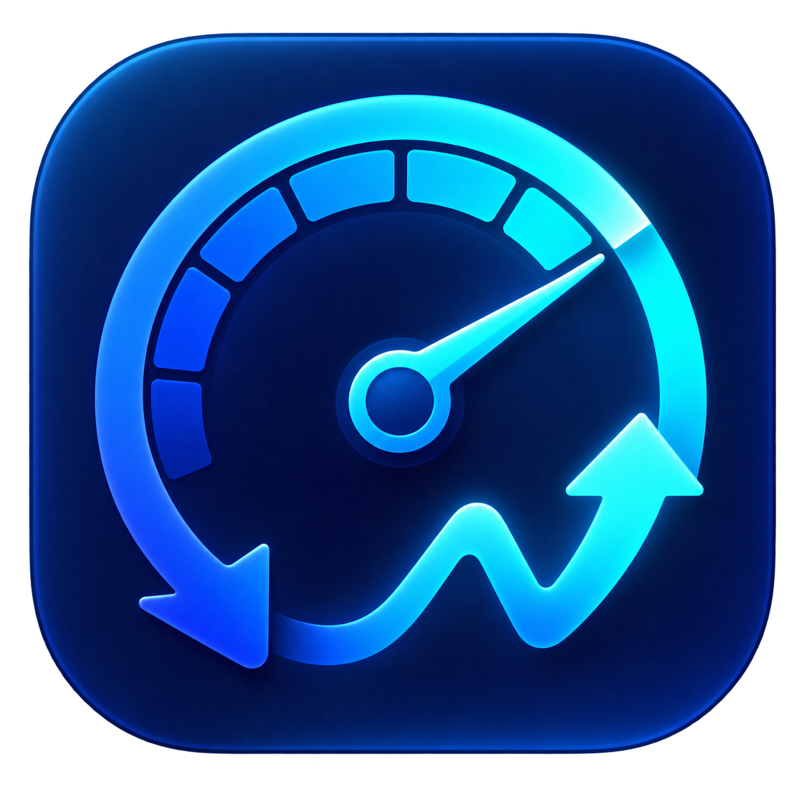

<p align="center">
  
</p>

<h1 align="center">Internet Speed Reader</h1>

<p align="center">
  See your Mac’s network activity at a glance. Test its capacity when you need to.
</p>

<p align="center">
  <a href="https://github.com/Srimi1/Internet-speed-reader/releases">Download</a> ·
  <a href="#how-it-works">How it works</a> ·
  <a href="CONTRIBUTING.md">Contribute</a> ·
  <a href="SECURITY.md">Security</a>
</p>


A native **Swift menu bar app for macOS 14 and later**, built with AppKit and SwiftUI.
It starts monitoring at launch and keeps updating while the panel is closed. Use it to
see whether a download is progressing, notice an active upload, or spot a connection
outage without opening another window.

## What it does

- **Automatic live readings.** One-second updates by default, with an optional battery
  policy and recovery after missing counters, network changes and wake.
- **The direction that matters.** Download is the default, including `↓ 0.0` when idle.
  Sustained upload activity takes priority, even during a faster download.
- **Both directions on demand.** Click the menu bar item for live download and upload;
  use **Go / Stop** to control a capacity test.
- **Clear measurement status.** Unavailable or stale live data shows `—`. Tests show
  errors and quality labels; previous results retain their time and measurement method.
- **Connection awareness.** Outage detection, a local outage log and silent notification
  banners, subject to macOS notification permissions and Focus settings.
- **Made for the menu bar.** Launch at login, selectable layouts and Mbps or MB/s units.

## Install

Download a disk image from [GitHub Releases](https://github.com/Srimi1/Internet-speed-reader/releases),
open it, and drag **InternetSpeedReader.app** into **Applications**. Open the app there;
its icon appears in the menu bar. Launch at login is enabled by default and can be
changed in Settings.

Public builds use an ad-hoc signature and are **not notarized by Apple**. Gatekeeper may
block a downloaded build. Keep macOS security protections enabled; building the source
locally is an alternative. Release notes identify the artifact and its SHA-256 checksum.

To move the menu bar item, hold **Command** and drag it. If a crowded or notched menu bar
hides it, choose a more compact layout in Settings.

### Build from source

You need macOS 14+, Xcode with Swift 6 support, and [XcodeGen](https://github.com/yonaskolb/XcodeGen).
Builds do not require an API key or the maintainer’s signing certificate.

```bash
git clone https://github.com/Srimi1/Internet-speed-reader.git
cd Internet-speed-reader
./scripts/install.sh
```

See [Contributing](CONTRIBUTING.md) for development setup, signing options and tests.
`./scripts/make-dmg.sh` produces a disk image in `dist/`.

## How it works

The app answers two different questions:

| | Live menu bar and panel | Manual capacity test |
|---|---|---|
| Question | How much traffic is moving now? | How fast can this test connection transfer data? |
| Source | macOS kernel interface counters | Payload transferred by the test engine |
| Scope | All apps on the selected network interface | Cloudflare, or Apple Deep Test |
| While idle | Usually near zero | Requires starting a test |
| If data is invalid | An unavailable indicator | An error or a limited-result label |

**Live monitoring** reads 64-bit byte and packet counters from the kernel. Speeds use
actual elapsed time, with time-based smoothing. Interface selection avoids counting
both a physical connection and its VPN tunnel. The meter measures aggregate traffic,
which can include protocol overhead, retransmissions and local-network transfers;
it does not identify individual apps or inspect their packet contents.

Upload detection allows for small control packets before applying a sustained-activity
threshold. This is a conservative heuristic: a small upload during heavy downloading
can remain filtered, and VPN or QUIC traffic can affect classification. The displayed
upload rate is always the measured rate; the allowance only selects the direction.

**Go** uses Cloudflare’s public speed-test endpoints. Downloads require a valid response
and the exact requested body length; uploads require a matching server-confirmed byte
count. Final rates use validated transfers over measured time after a 1.5-second warm-up,
including stalls. Concurrent streams share time and byte budgets. Provisional progress
is separate from saved results, and cancelled or failed transfers cannot become a
successful measurement.

**Apple Deep Test**, available from the panel’s menu, runs macOS `networkQuality` as a
second opinion. It also reports responsiveness under load when available. Providers,
routes and methods differ, so results need not match each other or Ookla. Cloudflare
explains these differences in its [measurement overview](https://speed.cloudflare.com/about).

**Outage detection** combines network-path changes with small connectivity probes.
Two failed probes confirm an outage, one success clears it, and grace periods reduce
notifications during launch, wake and interface changes. Connectivity probes pause
during sleep and capacity tests.

## Privacy and security

There is no account, API-key setup, analytics SDK or application telemetry service.
The app does make network requests for these features:

| Feature | Network or local data used |
|---|---|
| Live traffic meter | Local aggregate kernel counters; no packet-content capture |
| Automatic connectivity checks | HTTPS requests to Google’s `gstatic.com`; Apple’s `captive.apple.com` HTTP check is the fallback for detecting captive portals |
| Manual Go test | Synthetic test traffic and server metadata from `speed.cloudflare.com` |
| Manual Apple Deep Test | Test traffic through the system `networkQuality` tool to Apple’s test service |
| Local history | Test timestamps, speeds, quality and available provider/location/server metadata; outage times and interface information |

Network providers can see ordinary connection information, including your public IP
address. Upload tests generate random test data; they do not upload your documents.
Preferences and history are stored in your macOS user account. Clear test history and
outages from **Settings → Network**. These local records can contain personal network
information, so review and redact them before attaching anything to a public issue.

Read the [security policy](SECURITY.md) for private vulnerability reporting and the
[contribution guidelines](CONTRIBUTING.md) before sharing logs, configuration or patches.

## Current status and limits

Version **1.1.0** adds automatic-monitoring recovery and validated test accounting.
The core suite has **125 passing tests** covering timing, counters, direction selection,
transport failures, cancellation, subprocess cleanup and history compatibility.
See the [changelog](CHANGELOG.md) and [verification report](docs/VERIFICATION-1.1.md)
for the tested scope and remaining checks.

- During v1.1.0 verification, Cloudflare refused a download request with **HTTP 403**.
  The app reports the refusal and does not save a successful result. Apple Deep Test
  remains an alternative. Three successful sequential Cloudflare comparisons are
  still outstanding; there is no claim of parity with Ookla.
- Capacity tests are manual and transfer real data. Data-saver mode reduces budgets;
  the displayed usage estimate is approximate.
- Some existing Settings controls remain unwired, including metered-test confirmation,
  notification timing preferences and automatic panel reopening. See
  [remaining limitations](docs/ARCHITECTURE.md#remaining-limitations) before relying on them.
- Exact application attribution, scheduled capacity tests, auto-update and Apple
  notarization are not implemented.

## Development

`SpeedCore` contains the UI-free measurement and state logic. The app target supplies
AppKit, SwiftUI, lifecycle handling and system integrations. Tests link only `SpeedCore`
and use local doubles; they do not start the menu bar app or run internet speed tests.

```bash
xcodegen generate --spec project.yml
xcodebuild -project InternetSpeedReader.xcodeproj \
  -scheme InternetSpeedReader \
  -destination 'platform=macOS' \
  -derivedDataPath "$HOME/Library/Developer/Xcode/DerivedData/InternetSpeedReader" \
  test
```

Explore the [architecture](docs/ARCHITECTURE.md), [design decisions](docs/DECISIONS.md)
and [contribution guide](CONTRIBUTING.md). For bugs and feature requests, use
[GitHub Issues](https://github.com/Srimi1/Internet-speed-reader/issues).

## Uninstall

Turn off **Launch at login** in Settings, then run `./scripts/uninstall.sh` from the
source checkout. The script removes the app, preferences, test history and outage log.

## License

[Apache-2.0](LICENSE). This project is independent and is not affiliated with or endorsed
by Apple, Cloudflare or Ookla.
