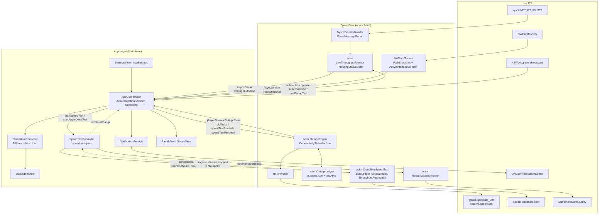

# Architecture

This document describes how Internet Speed Reader is put together as of v1.0.0 (merge commit `d0ee6db`, tag `v1.0.0`). It is written for an engineer or agent who has never seen the code. Every claim below was checked against the files under `Sources/`, `Tests/`, `scripts/` and `project.yml`. Where the approved plan and the code disagree, the code wins and the difference is listed in the final section.

Total source under `Sources/` is about 5,000 lines of Swift across two targets.

## 1. Targets

`project.yml` is the single source of truth for the Xcode project. `xcodegen generate` writes `InternetSpeedReader.xcodeproj` (git-ignored) and `Support/Info.plist` (from the `info.properties` block; edit `project.yml`, not the plist).

| Target | Type | Sources | `SWIFT_DEFAULT_ACTOR_ISOLATION` | Depends on | Target-specific settings |
|---|---|---|---|---|---|
| `SpeedCore` | `library.static` | `Sources/SpeedCore` | `nonisolated` | nothing | `SKIP_INSTALL YES`, `SWIFT_INSTALL_OBJC_HEADER NO`, `SWIFT_OBJC_INTERFACE_HEADER_NAME ""` |
| `InternetSpeedReader` | `application` | `Sources/App` | `MainActor` | `SpeedCore` | bundle id `com.srimi.internetspeedreader`, `ENABLE_APP_SANDBOX NO`, `LSUIElement true`, `LSAppNapIsDisabled true`, ATS exception for `captive.apple.com` |
| `SpeedCoreTests` | `bundle.unit-test` | `Tests/SpeedCoreTests` | `nonisolated` | `SpeedCore` only | ad-hoc signing (`-`), hardened runtime off, generated Info.plist, no `TEST_HOST` |

Shared base settings: Swift 6.0 language mode, deployment target macOS 14.0, `MARKETING_VERSION 1.0.0`, `CURRENT_PROJECT_VERSION 1`, manual signing with `Apple Development: 917762034141 (XB7X3VP977)`, `DEVELOPMENT_TEAM Z6SX8L9HA7`, hardened runtime on, dead-code stripping on, user script sandboxing on. There is no entitlements file and no asset catalog in the repository (the `ASSETCATALOG_COMPILER_APPICON_NAME AppIcon` setting is present but nothing supplies it).

The scheme `InternetSpeedReader` builds the app for every action, builds `SpeedCoreTests` for the test action only, runs and tests in Debug, and archives in Release.

### Why the split

- `SpeedCore` holds every measurement, parser and decision. It imports only `Foundation`, `Network` and `os`. Nothing in it touches AppKit, SwiftUI, UserNotifications or ServiceManagement. Because its default isolation is `nonisolated`, each type must say where it runs: actors own mutable state and timers, value types are pure, and the few classes that URLSession or `Process` call back into are lock-guarded and `Sendable`.
- The app target holds everything that must run on the main thread. With `MainActor` as the default, AppKit and SwiftUI code compiles without annotating every class. `AppCoordinator` relies on that default; `AppSettings`, `SpeedTestController`, `LoginItemManager`, `NotificationService`, `PowerPolicy` and `StatusItemController` also carry an explicit `@MainActor`.
- `SpeedCoreTests` links `SpeedCore` alone, so `xcodebuild test` never launches the menu bar agent, never needs a signing identity, and never touches the network. It runs 75 tests in 16 suites (Swift Testing, `@testable import SpeedCore`).

Two build facts measured on 2026-09-04 matter for anyone changing `project.yml`:

1. `SWIFT_DEFAULT_ACTOR_ISOLATION` never appears in the `xcodebuild` log. It was proven to reach the compiler empirically: a probe that calls a `@MainActor` function synchronously compiles in the app target and fails in `SpeedCore` with "call to main actor-isolated global function in a synchronous nonisolated context".
2. `ENABLE_USER_SCRIPT_SANDBOXING YES` blocked the static library's ObjC header copy phase. `SWIFT_INSTALL_OBJC_HEADER NO` on `SpeedCore` is the fix; do not remove it.

## 2. Directory map

### `Sources/SpeedCore/Support`

| File | Key types | What it does |
|---|---|---|
| `AppPaths.swift` | `enum AppPaths` | `bundleIdentifier`, `applicationSupportDirectory()`, `cachesDirectory()`, `uploadFixturesDirectory()`; creates the directories on demand |
| `AtomicJSONStore.swift` | `struct AtomicJSONStore<Record>`, `Envelope` | Versioned `{version, records}` JSON file; ISO 8601 dates; atomic write; trims to `cap`; unknown version or decode failure moves the file to `.bak` and returns `[]` |
| `Deadline.swift` | `DeadlineExceeded`, `withDeadline(_:clock:operation:)` | Races an operation against a sleep in a task group; every network call in the app goes through it |
| `Formatters.swift` | `SpeedUnit`, `SpeedFormatter`, `DurationFormatter` | `bar()` (compact, half-up rounding, `G` suffix above 1000, no decimal above 10G), `panel()`, `widestBarSamples()`, `humanReadable()` |
| `Log.swift` | `enum Log` | `os.Logger` categories `live`, `outage`, `speedtest`, `app` under subsystem `com.srimi.internetspeedreader` |
| `RingBuffer.swift` | `struct RingBuffer<Element>` | Fixed-capacity FIFO for the sparkline |
| `TimeSource.swift` | `protocol TimeSource`, `SystemTimeSource` | Monotonic `now()`, `wallClock()`, `sleep(for:tolerance:)`; plus `Duration.seconds` and `Instant.seconds(since:)` |

### `Sources/SpeedCore/Counters`

| File | Key types | What it does |
|---|---|---|
| `ActiveDirectionSelector.swift` | `TrafficDirection`, `ActiveDirectionSelector` | Picks the one number the adaptive bar shows: download by default; upload only if `up > down * 1.3` and `max >= 0.15 Mbps`; holds a choice for 3 s |
| `InterfaceCounters.swift` | `IFCounters`, `protocol CounterSource` | `rx`/`tx` byte counters and the read interface |
| `LiveThroughputMonitor.swift` | `actor LiveThroughputMonitor`, `Cadence` | Sampling loop; owns the baseline; `samples()` returns an `AsyncStream<ThroughputSample>`; `setInterface`, `clearInterface`, `setCadence`, `setDuringTest`, `resetBaseline`, `start`, `stop`, `pause` |
| `RouteMessageParser.swift` | `enum RouteMessageParser` | Pure walk over a `NET_RT_IFLIST2` buffer reading `if_msghdr2.ifm_data` (64-bit `if_data64`); advances by `ifm_msglen`; `loadUnaligned`; `name(forIndex:)`, `index(forName:)` |
| `SysctlCounterReader.swift` | `struct SysctlCounterReader: CounterSource` | `sysctl` with mib `[CTL_NET, PF_ROUTE, 0, 0, NET_RT_IFLIST2, index]`; retries once on `ENOMEM`; no root needed |
| `ThroughputSampler.swift` | `ThroughputSample`, `ThroughputCalculator` | Pure delta-to-rate math: `tooSoon` under 0.2 s, `rebaseline` on a gap over 5 s, a counter going backwards, or a rate over 50,000 Mbps |

### `Sources/SpeedCore/Path`

| File | Key types | What it does |
|---|---|---|
| `NWPathSource.swift` | `protocol PathSource`, `NWPathSource`, private `GenerationCounter` | Wraps `NWPathMonitor` on queue `com.srimi.internetspeedreader.path`; converts each `NWPath` to a `PathSnapshot`; `.other` interfaces named `utun`, `ipsec`, `ppp`, `tun`, `tap`, `wg` become `.tunnel` |
| `PathSnapshot.swift` | `PathSnapshot`, `Interface`, `Interface.Kind`, `enum ActiveInterfaceSelector` | Sendable view of the path; selector dedupes by index (NWPath lists `en0` once per address family), drops `lo0`, `awdl0`, `llw0`, `anpi*`, `bridge0`, `ap1`, `gif0`, `stf0`, prefers a physical interface, then a tunnel |

### `Sources/SpeedCore/Probe`

| File | Key types | What it does |
|---|---|---|
| `ConnectivityProbe.swift` | `ProbeFailureKind`, `ProbeOutcome`, `protocol Prober`, `HTTPProber` | Primary `HEAD https://www.gstatic.com/generate_204` (expects 204, 1.5 s budget); fallback `GET http://captive.apple.com/hotspot-detect.html` whose body must contain `Success`, else `.captivePortal`; whole round shares a 3 s budget; session has `waitsForConnectivity = false`, no cache |

### `Sources/SpeedCore/Outage`

| File | Key types | What it does |
|---|---|---|
| `ConnectivityStateMachine.swift` | `ConnectivityStateMachine`, `Config`, `State`, `SuspendReason`, `Event`, `Effect` | Pure reducer: `handle(_:now:wallClock:) -> [Effect]`. Defaults: 2 failures to confirm, 3 s path debounce, notify after 10 s, 20 s wake grace, 15 s interface-change grace, 10 s launch grace, probe every 15 s online, 2 s degraded, 30 s after 10 failures |
| `OutageEngine.swift` | `OutageEvent`, `actor OutageEngine` | Feeds the machine with real time, probes and timers; applies effects to the ledger; publishes `stateChanged`, `notifyDown`, `notifyUp`, `ledgerChanged` on `events()`; heartbeat every 60 s; `shutdown()` closes an open outage as `.quit` |
| `OutageLedger.swift` | `protocol HeartbeatStore`, `UserDefaultsHeartbeatStore`, `MemoryHeartbeatStore`, `actor OutageLedger` | In-memory record list persisted through `AtomicJSONStore`; `load()` closes crash orphans at `lastAlive` with `.crash`; `close()` drops records shorter than `minimumDuration` (3 s) |
| `OutageRecord.swift` | `OutageCause`, `OutageEnd`, `OutageRecord` | Codable record: `start` (first failure), `confirmedAt`, `end`, `interfaceName`, `cause`, `unsatisfiedReason`, `failureKinds`, `notified`, `endReason` |

### `Sources/SpeedCore/SpeedTest`

| File | Key types | What it does |
|---|---|---|
| `SpeedTestResult.swift` | `SpeedTestEngineID`, `SpeedTestResult`, `AppleExtras`, `SpeedTestPhase`, `SpeedTestProgress`, `SpeedTestError` | The result record for both engines; Apple's numbers live only in `apple` |
| `Cloudflare/ByteLedger.swift` | `final class ByteLedger` | One `OSAllocatedUnfairLock<UInt64>` shared by every stream in a phase |
| `Cloudflare/ChunkLadder.swift` | `ChunkLadder` | Request size from the per-stream rate: about 2 s of work, power of two, 256 KiB floor, 50 MiB ceiling, 1 MiB first probe |
| `Cloudflare/CloudflareEndpoints.swift` | `enum CloudflareEndpoints` | `https://speed.cloudflare.com/__down?bytes=N&isr=nonce`, `/__up`, `/meta` (needs `Referer` and `Origin` or it returns 403) |
| `Cloudflare/CloudflareMeta.swift` | `CloudflareMeta` | Tolerant decoder for `/meta`; `ispDisplayName`, `clientLocation`, `serverDisplayName` |
| `Cloudflare/CloudflareSpeedTest.swift` | `SpeedTestOptions`, `actor CloudflareSpeedTest`, `actor SliceSampler` | The engine: meta, latency (20 samples, `Server-Timing` subtracted), download, upload; one `URLSession` per stream with `httpMaximumConnectionsPerHost = 1`; `SliceSampler` reads the ledger every 100 ms |
| `Cloudflare/DownloadStream.swift` | `final class DownloadStream` | One download stream that owns its own session and acts as the session-level `URLSessionDataDelegate`; validates the response headers, counts bytes into the ledger, records the negotiated protocol |
| `Cloudflare/ResponseValidator.swift` | `ResponseValidation`, `enum ResponseValidator` | Download must be 200, `application/octet-stream`, and exactly the requested length; upload must be 200 with `cf-meta-upload-bytes` equal to the bytes sent; 403 with a one-byte body is the byte cap, otherwise 403/429 is rate limiting |
| `Cloudflare/ServerTiming.swift` | `ServerTiming` | Parses `cfSpeedEdge`, `cfSpeedWorker` (ms) and `cfL4` `rtt`/`min_rtt` (microseconds to ms) |
| `Cloudflare/StreamDelegates.swift` | `final class UploadStreamDelegate` | Task delegate that adds `didSendBodyData` deltas to the ledger |
| `Cloudflare/ThroughputAggregator.swift` | `ThroughputSlice`, `ThroughputSummary`, `ThroughputAggregator` | Drops the first 1.5 s, trims the lowest 30 percent and highest 10 percent of slices, reports the trimmed mean as the headline, total bytes over total seconds as `meanMbps`, the 95th percentile slice as `peakMbps`; under 10 slices is an error, under 30 is `shortSample` |
| `Cloudflare/UploadFixture.swift` | `UploadFixture` | Random-byte files of 1, 4, 16 and 32 MiB, created on demand and reused |

### `Sources/SpeedCore/Apple`

| File | Key types | What it does |
|---|---|---|
| `NetworkQualityReport.swift` | `NetworkQualityReport` | All-optional decode of `networkQuality -c` JSON; throughput is in bits per second |
| `NetworkQualityRunner.swift` | `actor NetworkQualityRunner`, private `ResumeGuard` | Runs `/usr/bin/networkQuality -c -s -M <seconds> [-I <iface>]` through `Process`, drains both pipes, hard-kills after `maxSeconds + 10` |

### `Sources/App`

| File | Key types | What it does |
|---|---|---|
| `InternetSpeedReaderApp.swift` | `@main InternetSpeedReaderApp` | The only SwiftUI scene is `Settings { SettingsView() }`; the delegate is attached with `@NSApplicationDelegateAdaptor` |
| `AppDelegate.swift` | `AppDelegate` | Handles maintenance flags, sets `.accessory` activation policy, creates `StatusItemController`, starts and shuts down the coordinator |
| `AppCoordinator.swift` | `@Observable AppCoordinator`, `ConnectionDisplayState` | Composition root; owns the monitor, path source, outage engine, settings, notifications, login item and speed test controller; mirrors every async stream into observable state |
| `AppSettings.swift` | `@Observable @MainActor AppSettings`, `Key`, `RefreshPolicy` | Typed `UserDefaults` wrapper; `speedTestOptions`, `estimatedBytesPerTest` |
| `LoginItemManager.swift` | `LoginItemManager`, `State` | `SMAppService.mainApp` register/unregister/status; `isInApplicationsFolder` |
| `NotificationService.swift` | `NotificationService`, `Identifier`, `Category` | `UNUserNotificationCenter` wrapper; requests `.alert` only; posts with `sound = nil`, `interruptionLevel = .active`; identifiers `isr.outage.down` and `isr.outage.up`; category `OUTAGE` with actions `RUN_TEST` and `SHOW_LOG` |
| `PowerPolicy.swift` | `enum PowerPolicy` | Cadence from power state: 5 s in Low Power Mode, 2 s on battery (IOKit power sources), otherwise 1 s |
| `SpeedCoreFormatter.swift` | `enum SpeedCoreFormatter` | Naming shim over `SpeedFormatter` for views |
| `SpeedTestController.swift` | `@Observable @MainActor SpeedTestController`, `RunState` | Runs one test at a time on either engine; keeps `history` (cap 200) and `latestResult`; enforces 30 s between runs and a 15 minute block after a rate limit; `onStateChange` tells the coordinator when a test starts or ends |
| `Popover/GaugeView.swift` | `GaugeArc`, `GaugeView`, `SpeedFormatterBridge` | 270-degree arc on a log scale from 0.1 to 1000 Mbps, with the GO/Stop control |
| `Popover/PanelView.swift` | `PanelView`, `Sparkline` | The 330 pt popover: status header with gear menu, live tiles and sparkline, gauge, result tiles, ISP/server row, History and Outages tabs, footer |
| `Settings/SettingsView.swift` | `SettingsView` plus private `GeneralSettings`, `AlertSettings`, `SpeedTestSettings`, `NetworkSettings` | Four-tab settings window, 460 by 300 |
| `StatusBar/StatusItemController.swift` | `StatusItemController` | Owns the `NSStatusItem` (autosave name `com.srimi.internetspeedreader.readout`), a 500 ms refresh loop, the transient `NSPopover`, and the right-click `NSMenu` |
| `StatusBar/StatusItemView.swift` | `StatusItemRenderModel`, `BarLayout`, `StatusItemView` | Custom `NSView` drawing the dot and text; width pinned to the widest string the layout can produce; layouts `adaptive`, `twoLine`, `oneLine`, `dotOnly` |

### `Tests/SpeedCoreTests`

| File | Suite | Test doubles defined in the file |
|---|---|---|
| `ActiveDirectionSelectorTests.swift` | Active direction selector | none |
| `ActiveInterfaceSelectorTests.swift` | Active interface selector | none |
| `CloudflareDecodingTests.swift` | Cloudflare metadata decoding, Response validation, Upload fixtures | none |
| `ConnectivityStateMachineTests.swift` | Connectivity state machine | `Driver` (hand-advanced clock around the reducer) |
| `FormatterTests.swift` | Formatters | none |
| `OutageEngineTests.swift` | Outage engine | `ScriptedProber`, `FastClock` (sleeps advance time instantly), `Flags`, `tempLedger()` |
| `OutageLedgerTests.swift` | Outage ledger | `tempStore()`; uses `MemoryHeartbeatStore` from `SpeedCore` |
| `RouteMessageParserTests.swift` | Route message parser | `MessageBuilder` (synthetic `NET_RT_IFLIST2` buffers) |
| `SpeedTestMathTests.swift` | Server timing parser, Chunk ladder, Throughput aggregator, Byte ledger | none |
| `SupportTests.swift` | Support layer | none |
| `ThroughputCalculatorTests.swift` | Throughput calculator | none |

### Other top-level files

| Path | Purpose |
|---|---|
| `project.yml` | XcodeGen spec (see section 1) |
| `Support/Info.plist` | Generated from `project.yml`; committed so a fresh checkout has it, but regenerated on every `xcodegen generate` |
| `scripts/install.sh` | Generate, build Release, install to `/Applications`, verify signature, launch |
| `scripts/make-dmg.sh` | Build Release, stage outside iCloud, re-sign, create `dist/InternetSpeedReader-<version>.dmg` |
| `scripts/uninstall.sh` | Quit, unregister the login item through the app binary, delete the app, Application Support, Caches and defaults |
| `.gitignore` | Ignores the generated project, DerivedData, `dist/`, `build/`, `*.icloud`, `._*` and friends |

## 3. Runtime data flow



### Startup

`AppDelegate.applicationDidFinishLaunching` first checks for a `--` flag (section 6). Otherwise it sets `NSApp.setActivationPolicy(.accessory)`, creates `StatusItemController`, and calls `AppCoordinator.start()`, which in order: bootstraps notifications (sets the center delegate, registers the `OUTAGE` category), refreshes the login item and reconciles it against `launchAtLoginWanted`, requests notification authorization if still `.notDetermined`, begins a `ProcessInfo` activity (`.userInitiatedAllowingIdleSystemSleep`, reason "Live link throughput"), wires the speed test callbacks, subscribes to sleep and wake, starts the outage engine, starts path observation, and starts the live meter.

### Live meter

1. `NWPathSource.snapshots()` yields a `PathSnapshot` on every `NWPathMonitor` update. `AppCoordinator.apply(_:)` stores it, forwards it to the outage engine, and runs `ActiveInterfaceSelector` through `snapshot.activeInterface`. If the selected interface index changed, the coordinator zeroes its smoothing state and calls `monitor.setInterface(name:index:)` or `monitor.clearInterface()`.
2. `LiveThroughputMonitor.start()` runs a loop: `tick()`, then `time.sleep(for: cadence)` with 250 ms tolerance. The cadence is set once at startup from `PowerPolicy.currentCadence()`. Each tick asks `SysctlCounterReader.counters(forInterfaceIndex:)`, which performs the sysctl and hands the buffer to `RouteMessageParser.parse(_:wantIndex:)`.
3. `ThroughputCalculator.evaluate(previous:current:elapsedSeconds:)` turns the counter delta and the measured elapsed time (never the nominal interval) into Mbps, or asks for a rebaseline. Only `.rate` results are yielded as `ThroughputSample` on the stream.
4. `AppCoordinator.ingest(_:)` applies an exponential moving average with factor 0.5 to `downMbps` and `upMbps`, appends the raw sample to a 120-entry `RingBuffer`, and feeds the raw sample to `ActiveDirectionSelector.update(...)` to get `activeDirection`.
5. `StatusItemController` does not observe the coordinator. Every 500 ms it reads `downMbps`, `upMbps`, `activeDirection`, `connectionState` and the bar settings, formats them with `SpeedFormatter.bar`, builds a `StatusItemRenderModel`, and assigns it to `StatusItemView.model`. The view redraws only when the model changed. The item width is recomputed only when layout, unit or `showUnits` change.
6. `PanelView` reads the coordinator through `@Environment(AppCoordinator.self)` and redraws through Observation.

Measured on 2026-09-04 against a real 50 MiB download: the link-layer meter read 154.45 Mbps while the payload rate was 140.96 Mbps, a 9.6 percent difference. This is why the footer and tooltip say the bar reads higher than a speed test.

### Outage detection

1. `OutageEngine.start()` loads the ledger (which closes any crash-orphaned record at the last heartbeat), starts the 60 s heartbeat, and dispatches `.launched`.
2. Every `dispatch` calls `ConnectivityStateMachine.handle(event, now:, wallClock:)` and applies the returned effects: `scheduleProbe` cancels and re-arms `probeTask`; `openOutage`, `recordFailure`, `closeOutage` go to `OutageLedger`; `notifyDown` marks the record notified and yields `.notifyDown(record)`; `notifyUp` yields `.notifyUp(record)` for the record just closed; `scheduleNotifyCheck` re-arms `notifyTask`, which later dispatches `.tick`. If the machine's state changed, `.stateChanged` is yielded.
3. `runProbe()` is skipped entirely while the machine is `.suspended` (sleep or speed test). Otherwise it awaits `HTTPProber.probe()` and dispatches the outcome. Measured on 2026-09-04: a healthy probe took 216 ms cold and 46 to 49 ms warm; a blackholed `192.0.2.1` failed through the deadline at 3003 to 3006 ms.
4. `AppCoordinator.handle(_:engine:)` maps machine state to `ConnectionDisplayState` (which drives dot colour and red text), refreshes `outages` from the ledger on `.ledgerChanged`, and posts banners through `NotificationService.post`. The "back" banner replaces the "down" banner by identifier.
5. `NSWorkspace.willSleepNotification` pauses the monitor and sends `willSleep` (which closes an open outage as `.sleep`). `didWakeNotification` resets the baseline, restarts the monitor and sends `didWake`, which opens a 20 s grace window during which banners are suppressed but the ledger keeps recording.
6. The engine is built with the default `Config` and the ledger with the default 3 s minimum. The settings values `notifyAfterSeconds` and `minimumOutageSeconds` are stored but not passed in (see section 8).

### Speed test

1. `AppCoordinator.startSpeedTest()` calls `SpeedTestController.start(interfaceName:options:)` with `settings.speedTestOptions`. The controller refuses if a test is running, a rate-limit block is active, or fewer than 30 s have passed since the last run.
2. `onStateChange(true)` makes the coordinator set `connectionState = .testing`, call `engine.speedTestStarted()` (suspending outage detection) and `monitor.setDuringTest(true)` (so samples are flagged).
3. `CloudflareSpeedTest.run` performs, in order: `/meta` (4 s deadline, failure only blanks the ISP), latency (up to 20 `GET /__down?bytes=0` requests within 6 s, first sample treated as cold, median and mean absolute delta reported, `cfL4 min_rtt` kept as `tcpMinRttMs`), a 1 MiB download probe to size chunks, the download phase, an upload probe with the 1 MiB fixture, and the upload phase. Each phase runs N streams in a task group against one shared `ByteLedger` while `SliceSampler` snapshots the ledger every 100 ms and calls the progress closure. `ThroughputAggregator` produces the headline.
4. The progress closure is `@Sendable`; `SpeedTestController` wraps each call in `Task { @MainActor in ... }` to update `phase`, `liveMbps` and `fraction`.
5. On success `finish(with:)` inserts the result at the head of `history`, saves the reversed list to `speedtests.json`, records `lastRunFinished`, and fires `onStateChange(false)`, which resumes the outage engine with a 2 s grace and a synthetic online probe. On `SpeedTestError.rateLimited` the controller sets `blockedUntil` 15 minutes ahead.
6. The Apple deep test follows the same controller path but calls `NetworkQualityRunner.run(interfaceName:)` with the default 15 s cap; its result carries `engine = .appleNetworkQuality` and `apple: AppleExtras`, and the panel labels its tiles BASE RTT and RPM instead of PING and JITTER.

The `interfaceName` passed to the Cloudflare engine is only recorded on the result; the test follows the system default route. The Apple runner passes it as `-I`.

Live run on 2026-09-04: 176.3 Mbps download (6 streams, 2048 KiB chunks, 205.5 MB), 137.9 Mbps upload (4 streams, 122.7 MB, all confirmed through `cf-meta-upload-bytes`), ping 82.8 ms, jitter 15.6 ms, TCP min RTT 32.1 ms, protocol `http/1.1`, 23.6 s wall time. `speed.cloudflare.com` negotiated HTTP/1.1 only, which is why one session per stream matters: a shared session could coalesce streams if HTTP/2 were ever offered.

## 4. Concurrency model

| Role | Types |
|---|---|
| Actors that own I/O, timers and mutable state | `LiveThroughputMonitor`, `OutageEngine`, `OutageLedger`, `CloudflareSpeedTest`, `SliceSampler`, `NetworkQualityRunner` |
| Pure value types that hold decisions and never touch a clock or socket | `ConnectivityStateMachine`, `ThroughputCalculator`, `ActiveDirectionSelector`, `ActiveInterfaceSelector`, `RouteMessageParser`, `ChunkLadder`, `ThroughputAggregator`, `ResponseValidator`, `ServerTiming`, `SpeedFormatter`, `PathSnapshot`, `OutageRecord`, `SpeedTestResult` |
| `AsyncStream`s that carry data from `SpeedCore` into the main actor | `LiveThroughputMonitor.samples()`, `PathSource.snapshots()`, `OutageEngine.events()` |
| Lock-guarded `Sendable` classes for callbacks that arrive on URLSession or `Process` threads | `ByteLedger` and `DownloadStream` (`OSAllocatedUnfairLock`), `UploadStreamDelegate` (`OSAllocatedUnfairLock`), `GenerationCounter`, `MemoryHeartbeatStore`, `ResumeGuard` (`NSLock`) |
| Main-actor state the UI observes | `AppCoordinator`, `AppSettings`, `SpeedTestController`, `LoginItemManager`, `NotificationService` |

Rules the code follows:

- Elapsed time always comes from `TimeSource.now()` (a `ContinuousClock.Instant`), never from `Date`. `Date` is used only to stamp records people read. Tests inject `FastClock` or drive the reducer with a hand-advanced instant.
- Every network call is wrapped in `withDeadline`, because URLSession can stay silent on a blackholed route.
- `AppCoordinator` consumes each stream inside a `Task` created on the main actor, so the loop body runs on the main actor and can assign observable properties directly. Calls into actors are plain `await`s or fire-and-forget `Task { await ... }`.
- `DownloadStream` is the one place a session-level delegate is required. `URLSession.data(for:delegate:)` never calls `didReceive data` on a task-scoped delegate, so the first live run reported 0.0 Mbps download. The class owns its `URLSession`, receives every callback on a serial `OperationQueue`, and resumes a `CheckedContinuation` from `didCompleteWithError`.
- `CloudflareSpeedTest` shares phase-local results between task-group children through `OSAllocatedUnfairLock` boxes (`protocolBox`, `interceptBox`, `verified`) rather than actor state, so a stream never has to hop back to the actor per chunk.
- Shutdown is synchronous by design: `AppCoordinator.shutdown()` waits up to 1.5 s on a `DispatchSemaphore` for `OutageEngine.shutdown()` so an open outage is closed as `.quit` rather than being mistaken for a crash on the next launch.
- App Nap is opted out twice: `LSAppNapIsDisabled` in the Info.plist and `ProcessInfo.beginActivity`. The rate math would still be correct under nap because it divides by measured time; the opt-out is about the bar staying live.

## 5. Persisted state

All paths are under the user's home directory. The bundle identifier `com.srimi.internetspeedreader` is the key for every store and must never change.

| What | Path | Written by | Format and cap |
|---|---|---|---|
| Outage ledger | `~/Library/Application Support/com.srimi.internetspeedreader/outages.json` | `OutageLedger` through `AtomicJSONStore<OutageRecord>` (`OutageLedger.makeDefault()`) | `{"version":1,"records":[...]}`, ISO 8601 dates, pretty printed with sorted keys, cap 500, records under 3 s dropped at close |
| Speed test history | `~/Library/Application Support/com.srimi.internetspeedreader/speedtests.json` | `SpeedTestController` through `AtomicJSONStore<SpeedTestResult>` | Same envelope, cap 200 |
| Moved-aside stores | `outages.json.bak`, `speedtests.json.bak` in the same directory | `AtomicJSONStore.moveAside()` on an unknown version or a decode failure | Previous file, replaced on the next move-aside |
| Upload fixtures | `~/Library/Caches/com.srimi.internetspeedreader/upload/upload-<bytes>.bin` | `UploadFixture.url(forBytes:)` | Random bytes; rungs 1,048,576, 4,194,304, 16,777,216, 33,554,432; created only when a rung is first needed |

`UserDefaults` (standard suite, domain `com.srimi.internetspeedreader`). Keys are the raw values of `AppSettings.Key` unless noted.

| Key | Type | Default | Read by |
|---|---|---|---|
| `barLayout` | `BarLayout` raw string | `adaptive` | `StatusItemController` |
| `unit` | `SpeedUnit` raw string | `megabitsPerSecond` | `StatusItemController` |
| `showUnits` | Bool | `false` | `StatusItemController`, `StatusItemView` |
| `refreshPolicy` | `RefreshPolicy` raw string | `reduceOnBattery` | Settings UI only; `PowerPolicy` decides cadence from power state without reading it |
| `notifyOnDrop` | Bool | `true` | Settings UI only |
| `notifyOnRestore` | Bool | `true` | Settings UI only |
| `notifyAfterSeconds` | Double | `10` | Settings UI only; the engine uses `Config.notifyAfter` (10 s) |
| `minimumOutageSeconds` | Double | `3` | Settings UI only; the ledger uses its default 3 s |
| `downloadStreams` | Int | `6` | `AppSettings.speedTestOptions` |
| `uploadStreams` | Int | `4` | `AppSettings.speedTestOptions` |
| `phaseSeconds` | Double | `10` | `AppSettings.speedTestOptions` (download phase; upload is `max(4, phaseSeconds - 2)`) unless `dataSaver` |
| `dataSaver` | Bool | `false` | `AppSettings.speedTestOptions` (5 s / 4 s phases, 200 MiB / 100 MiB ceilings) |
| `confirmOnMetered` | Bool | `true` | Settings UI only |
| `appleMaxSeconds` | Int | `15` | Settings UI only; the runner is called with its default 15 |
| `reopenPanelOnFinish` | Bool | `true` | Settings UI only |
| `launchAtLoginWanted` | Bool | `true` | `AppCoordinator.reconcileLaunchAtLogin()` on every launch and `toggleLoginItem()` |
| `com.srimi.internetspeedreader.lastAlive` | Date | none | `UserDefaultsHeartbeatStore`; written every 60 s by the engine heartbeat, read once by `OutageLedger.load()` |

Two more pieces of system-owned state key off the bundle: the login item registration in the background task database (`SMAppService.mainApp`), and the status item position, which AppKit persists under the autosave name `com.srimi.internetspeedreader.readout`. `scripts/uninstall.sh` removes the app, both directories above, and the defaults domain, and unregisters the login item first because the database keys off the bundle path.

Launch at login is reconciled on every launch, not only the first. Reinstalling the bundle leaves the background task database pointing at a replaced bundle and `SMAppService` reports `.notFound`, which is why the first-run-only approach silently stopped working across a reinstall. Registration is skipped unless the app runs from `/Applications/`.

## 6. Maintenance flags

`AppDelegate.handleCommandLineFlags()` runs before anything else and exits the process with status 0 after handling the first argument that starts with `--`. They only work from inside the installed bundle because `SMAppService` keys off it:

```
/Applications/InternetSpeedReader.app/Contents/MacOS/InternetSpeedReader --login-status
/Applications/InternetSpeedReader.app/Contents/MacOS/InternetSpeedReader --register-login-item
/Applications/InternetSpeedReader.app/Contents/MacOS/InternetSpeedReader --unregister-login-item
```

| Flag | Effect |
|---|---|
| `--login-status` | Prints `login item: <state>` and the bundle path |
| `--register-login-item` | Calls `SMAppService.mainApp.register()`, prints the resulting state or `lastError` |
| `--unregister-login-item` | Calls `unregister()`; used by `scripts/uninstall.sh` before the bundle is deleted |
| anything else starting with `--` | Prints `unknown flag` and exits |

## 7. Build pipeline

```
xcodegen generate --spec project.yml
xcodebuild -project InternetSpeedReader.xcodeproj -scheme InternetSpeedReader \
  -configuration Release -derivedDataPath ~/Library/Developer/Xcode/DerivedData/InternetSpeedReader build
xcodebuild -scheme InternetSpeedReader -destination 'platform=macOS' test
```

The repository lives inside iCloud Drive and its path contains spaces. DerivedData is therefore kept at `~/Library/Developer/Xcode/DerivedData/InternetSpeedReader` (override with `DERIVED_DATA`), the generated project is git-ignored, and every script quotes every path.

`scripts/install.sh`: generate, build Release, quit any running copy with `osascript`, `rm -rf` the old bundle, `ditto` the build product to `/Applications/InternetSpeedReader.app`, `codesign --verify --strict --verbose=2`, then `open` it. `XCODEGEN` overrides the `/opt/homebrew/bin/xcodegen` path.

`scripts/make-dmg.sh`: reads `MARKETING_VERSION` from `project.yml`, builds Release, then stages in a `mktemp -d` directory under `$TMPDIR`. Staging inside iCloud Drive baked `com.apple.fileprovider.fpfs#P` and `com.apple.FinderInfo` extended attributes into the image, and `codesign` then rejected the installed app with "resource fork, Finder information, or similar detritus not allowed". The script copies with `ditto --noextattr --noqtn`, adds an `Applications` symlink and a `READ ME FIRST.txt`, runs `xattr -cr` on the app, re-signs it (`codesign --force --sign "$IDENTITY" --options runtime --timestamp=none`, `CODESIGN_IDENTITY` overrides), verifies, and runs `hdiutil create -volname "Internet Speed Reader" -format UDZO -fs APFS` into `dist/InternetSpeedReader-<version>.dmg`. It then verifies the image, signs it on a best-effort basis, prints the size and SHA-256, and deletes the staging directory. The build is Apple Development signed and not notarised, so first launch on another Mac needs right-click Open or `xattr -dr com.apple.quarantine`.

Signing note: `DEVELOPMENT_TEAM` must be the certificate's OU, `Z6SX8L9HA7`. The string in parentheses in the identity name, `XB7X3VP977`, is not the team and the build fails if it is used. A signed and installed build was confirmed correct by the notification permission prompt appearing from `/Applications`.

## 8. Deviations from the approved plan

The code is authoritative. These are the places where it differs from the approved plan, which is reproduced in full in `docs/PLAN.md`.

| Plan said | Code does |
|---|---|
| `DEVELOPMENT_TEAM: XB7X3VP977` | `Z6SX8L9HA7` (the certificate OU) |
| Verify the isolation flag by grepping the build log for `-default-isolation=MainActor` | The flag never appears in the log; verified by a probe compile instead |
| `NotificationSink.swift` protocol in `Sources/SpeedCore/Outage` | No such protocol. `OutageEngine` yields `OutageEvent`; the app's `NotificationService` posts banners |
| `ThroughputSampler.swift` is the sampling actor | The actor is `LiveThroughputMonitor.swift`; `ThroughputSampler.swift` holds `ThroughputSample` and the pure `ThroughputCalculator` |
| `SpeedTestEngine`, `SpeedTestHistory`, `StreamPool`, `LatencyPhase`, `LoadedLatencySampler`, `ISPResolver`, `AppleISPLookup` | None exist. Latency is `CloudflareSpeedTest.measureLatency`; history lives in `SpeedTestController`; ISP comes from `/meta`. Loaded latency is never measured: `downloadLoadedLatencyMs` and `uploadLoadedLatencyMs` exist on `SpeedTestResult` but are never set |
| `DownloadStreamDelegate` as a per-task delegate | `DownloadStream` owning its own session with a session-level delegate (the 0.0 Mbps bug fix) |
| `StatusItemMenu`, `PopoverController`, `ResultTilesView`, `LiveSectionView`, `SparklineView`, `HistoryTabView`, `OutageTabView` as separate files | The menu and popover are inside `StatusItemController`; the sections and `Sparkline` are inside `PanelView.swift` |
| Five settings tabs | Four: General, Alerts, Speed Test, Network |
| Metered or low-power confirmation sheet before a test | Not implemented; `confirmOnMetered` is stored only |
| `NWPathSource` dedupes equal snapshots | It yields every update with an incrementing `generation`; the coordinator and engine compare the selected interface themselves |
| Speed test captures `pathGeneration` and aborts with `networkChanged` if the path moves | `PathSnapshot.generation` is never read outside its own file and `SpeedTestError.networkChanged` is never thrown |
| `OutageRecord.interfaceKind`, `failureKinds: [String]` | No `interfaceKind`; `failureKinds` is `[ProbeFailureKind]` |
| Test doubles `FakeClock`, `FakeCounterSource`, `FakePathSource`, `FakeProber`, `RecordingNotificationSink`, `InMemoryStore`, `StubURLProtocol` | `Driver`, `FastClock`, `ScriptedProber`, `Flags`, `MessageBuilder`, and `MemoryHeartbeatStore` (shipped in `SpeedCore`); no URL protocol stub, no counter or path fakes |
| Two-line bar as the default | `BarLayout.adaptive` (one number following `ActiveDirectionSelector`) is the default; added after the plan, along with launch at login on by default |

Hooks that exist but are not connected, for anyone extending the app: `StatusItemController.reopenPanelForResult()` is never called, so `reopenPanelOnFinish` has no effect; `NotificationService.onRunTestRequested` and `onShowLogRequested` are never assigned, so the banner actions only bring the app forward; `CloudflareSpeedTest.sessions` is never appended to, so `teardownSessions()` does nothing (each phase invalidates its own sessions in `defer`).
